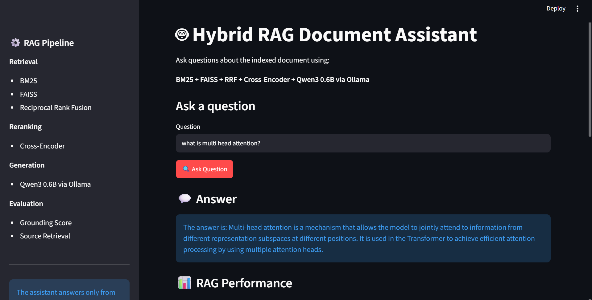

# Hybrid RAG Document Assistant

A document-grounded Retrieval-Augmented Generation (RAG) system that combines
keyword retrieval, semantic retrieval, rank fusion, neural reranking,
relevance gating, local LLM generation, and grounding evaluation.

Unlike a basic "chat with PDF" application, this project focuses on improving
**retrieval quality, answer grounding, out-of-domain rejection, and measurable
pipeline performance**.

The system was evaluated using the research paper:

> **Attention Is All You Need** — Vaswani et al.


---

## 🖥️ Demo




---

## 🚀 Overview

The system uses a multi-stage RAG pipeline:

```text
User Question
      │
      ├───────────────┐
      ▼               ▼
    BM25            FAISS
 Retrieval         Retrieval
      │               │
      └───────┬───────┘
              ▼
       Reciprocal Rank
          Fusion
              │
              ▼
       Cross-Encoder
         Reranking
              │
              ▼
        Relevance Gate
          /       \
        No         Yes
        │           │
        ▼           ▼
     Refuse      Context
                    │
                    ▼
             Qwen3 0.6B
              via Ollama
                    │
                    ▼
           Grounding Check
                    │
                    ▼
              Final Answer


🔍 Retrieval Pipeline
1. BM25 Retrieval

BM25 performs keyword-based retrieval.

It is useful when important terms from the user's question appear directly
in the document.

For example, a query containing terms such as:

scaled dot-product attention

can retrieve passages containing those exact concepts.

2. FAISS Semantic Retrieval

FAISS performs vector similarity search over document embeddings.

The project uses:

all-MiniLM-L6-v2

to convert document chunks and queries into vector representations.

This allows the system to retrieve semantically similar content even when
the exact query wording does not appear in the document.

3. Reciprocal Rank Fusion

BM25 and FAISS provide two different views of relevance.

Instead of relying on only one retriever, their ranked results are combined
using Reciprocal Rank Fusion (RRF).

BM25 Results
      +
FAISS Results
      │
      ▼
     RRF
      │
      ▼
Combined Candidates

This provides a stronger candidate set for the next stage.

🧠 Cross-Encoder Reranking

The candidates produced by RRF are passed to a Cross-Encoder.

Unlike the initial embedding-based retrieval stage, the Cross-Encoder evaluates
the query and document together to produce a more precise relevance score.

Query + Candidate Document
            │
            ▼
      Cross-Encoder
            │
            ▼
      Relevance Score

The highest-scoring documents are selected as the final context.

🛡️ Relevance Gate

Before generating an answer, the system checks whether the retrieved
documents are sufficiently relevant to the question.

This prevents the LLM from answering questions using its pretrained knowledge
when the information is not available in the indexed document.

For example:

Question:
What is the capital of France?


Result:


I don't have enough information in the provided documents.

This is important because a RAG system should remain document-grounded
rather than behaving like a general-purpose chatbot.

🤖 Local LLM Generation

The project uses:

Qwen3 0.6B

through:

Ollama

The LLM receives only the reranked document context and the user's question.

The generation prompt instructs the model to:

use only retrieved context
avoid outside knowledge
avoid unsupported claims
answer simple factual questions directly
remain concise
refuse when the context genuinely does not contain the answer
🎯 Grounding Evaluation

After generating an answer, the system performs a semantic grounding check.

The generated answer is compared against the retrieved context to estimate
how strongly the answer is supported by the available evidence.

The project reports a:

Semantic Grounding Score

This score is used as an evaluation signal rather than being treated as a
direct percentage of factual accuracy.

📊 Evaluation

The system was tested using four questions based on the
Attention Is All You Need paper.

Evaluation Questions
What is multi-head attention?
Why does scaled dot-product attention divide by the square root of dk?
How many attention heads does the Transformer use?
What is the capital of France?

The fourth question intentionally tests the system's ability to reject an
out-of-document question.

Retrieval Results

For all three answerable questions:

BM25 Hit@10       3/3
FAISS Hit@10      3/3
Hybrid Hit@3      3/3
Reranked Hit@3    3/3

This demonstrates that the hybrid retrieval pipeline successfully retrieved
relevant information for the evaluated questions.

Answer Quality Results
Question 1

What is multi-head attention?

Context Precision: 1.0000
Context Recall:    1.0000
Faithfulness:      0.7568
Answer Relevancy:  0.8000
Grounding Score:   0.7855
Question 2

Why does scaled dot-product attention divide by the square root of dk?

Context Precision: 1.0000
Context Recall:    1.0000
Faithfulness:      0.7000
Answer Relevancy:  0.7692
Grounding Score:   0.8071
Question 3

How many attention heads does the Transformer use?

Context Precision: 0.3333
Context Recall:    1.0000
Faithfulness:      1.0000
Answer Relevancy:  0.5000
Grounding Score:   0.8323

The answer produced was:

The Transformer uses 8 attention heads.

The lower context precision reflects that three documents were retained in
the final context while only the highest-ranked document directly supported
the answer.

Question 4 — Out-of-Domain Test

What is the capital of France?

The system correctly refused to answer:

I don't have enough information in the provided documents.

This demonstrates the intended out-of-domain behavior.

⚡ Performance

The pipeline includes component-level latency instrumentation.

Example measurements from the final system:

BM25:             ~0–16 ms
FAISS:            ~10–70 ms
RRF:              <1 ms
Cross-Encoder:    ~0.4–1.3 s
LLM Generation:   ~0.8–2.5 s
Grounding:        ~0.3–0.8 s

The exact latency varies between runs depending on system load.

⚙️ LLM Performance Optimization

The initial implementation used Transformers/PyTorch to run the LLM directly
on the CPU.

During testing, generation latency reached approximately:

75–103 seconds

The project was then migrated to:

Ollama + Qwen3 0.6B

After the change, observed generation latency dropped to approximately:

0.8–2.5 seconds

This made the application substantially more practical for local interactive
use on the available hardware.

The experiment also demonstrated that LLM generation was the dominant
component of end-to-end latency in the original implementation.

🖥️ Streamlit Interface

The project includes an interactive Streamlit interface.

The interface displays:

Generated answer
Grounding score
Number of retrieved documents
Total latency
LLM latency
Individual pipeline latencies
Cross-Encoder scores
Source pages
Retrieved document content
Combined context

This allows the RAG pipeline to be inspected rather than treating the system
as a black-box chatbot.

Run the application using:

python -m streamlit run app.py

The application will open locally in your browser.

🛠️ Tech Stack
Component	Technology
Language	Python
PDF Processing	PyPDF
RAG Framework	LangChain components
Text Splitting	RecursiveCharacterTextSplitter
Keyword Retrieval	BM25
Vector Search	FAISS
Embeddings	all-MiniLM-L6-v2
Rank Fusion	Reciprocal Rank Fusion
Reranking	Cross-Encoder
LLM Runtime	Ollama
LLM	Qwen3 0.6B
Grounding	Semantic similarity
UI	Streamlit
Evaluation	Custom RAG metrics
Version Control	Git / GitHub
📁 Project Structure
hybrid-rag-project/
│
├── .gitignore
├── README.md
├── app.py
├── main.py
├── requirements.txt
│
├── data/
│   └── pdfs/
│       └── source documents
│
└── src/
    │
    ├── loader.py
    ├── splitter.py
    ├── embedding.py
    ├── vector_store.py
    ├── bm25_retriever.py
    ├── rrf.py
    ├── crossencoder.py
    ├── hybrid_retrieval.py
    ├── llm.py
    ├── grounding.py
    ├── claim_verifier.py
    ├── evaluation.py
    │
    └── Evaluation/
        ├── evaluation.py
        ├── questions.py
        ├── rag_metrics.py
        └── test_relevance.py
🚀 Installation
1. Clone the repository
git clone https://github.com/Pranjazz/hybrid-RAG-document-assistant.git
cd hybrid-RAG-document-assistant
2. Create a virtual environment

Windows:

python -m venv venv

Activate it:

venv\Scripts\activate
3. Install Python dependencies
python -m pip install -r requirements.txt
4. Install Ollama

Install Ollama for Windows and make sure the ollama command is available
from the terminal.

Verify:

ollama --version
5. Pull the local model
ollama pull qwen3:0.6b

Verify:

ollama list

You should see:

qwen3:0.6b
▶️ Running the Application

Start Streamlit:

python -m streamlit run app.py

Then open the local Streamlit URL shown in the terminal.

Example question:

What is multi-head attention?

The application retrieves relevant document chunks, reranks them, generates
a grounded answer, and displays the retrieval and performance metrics.

🧪 Running Evaluation

The evaluation suite can be executed with:

python src/Evaluation/evaluation.py

The evaluation reports:

BM25 Hit@K
FAISS Hit@K
Hybrid Hit@K
Reranked Hit@K
Context Precision
Context Recall
Faithfulness
Answer Relevancy
Grounding Score
Retrieval latency
Reranking latency
🔬 Example
Question
How many attention heads does the Transformer use?
Retrieved evidence

The system retrieves the relevant section of the
Attention Is All You Need paper.

Answer
The Transformer uses 8 attention heads.
Evaluation
Grounding Score: 0.8323
Faithfulness:    1.0000
Context Recall:  1.0000
🚫 Out-of-Domain Example
Question
What is the capital of France?
Result
I don't have enough information in the provided documents.

The system intentionally refuses to answer because the indexed document does
not contain the required information.

💡 Why This Project Is Different

This is not designed as a simple:

PDF → Embeddings → LLM → Answer

pipeline.

Instead, it explores several stages of a production-style RAG architecture:

Keyword Retrieval
       +
Semantic Retrieval
       ↓
Rank Fusion
       ↓
Neural Reranking
       ↓
Relevance Filtering
       ↓
Grounded Generation
       ↓
Answer Evaluation

Each stage can be measured independently, making it possible to identify
retrieval, reranking, generation, and grounding bottlenecks.

⚠️ Limitations
The current evaluation dataset is relatively small.
The system is currently demonstrated using a single research paper.
CPU-only local inference is slower than GPU-backed inference.
The grounding score is a semantic evaluation signal and should not be
interpreted as a direct factual accuracy percentage.
Retrieval quality can vary depending on chunk size, document structure,
and query formulation.
The current Streamlit application is intended primarily as a demonstration
and research/portfolio project.
🔮 Future Improvements

Potential improvements include:

Larger evaluation datasets
Query expansion
Query rewriting
Adaptive retrieval depth
Better context compression
More advanced citation verification
Claim-level verification
Evaluation against larger RAG benchmarks
Streaming LLM responses
Caching frequently used embeddings and retrieval results
GPU-backed inference
Multi-document support
User-uploaded PDF support
Persistent vector database
Production API deployment
Observability and tracing
📌 Key Takeaways

The project demonstrates that a RAG system can be improved by combining
multiple retrieval and validation stages rather than relying on a single
vector search step.

The main engineering observations from the project were:

Hybrid retrieval successfully combined lexical and semantic search.
RRF provided a unified candidate ranking.
Cross-Encoder reranking improved the ordering of retrieved candidates.
Relevance gating prevented unsupported out-of-domain answers.
Grounding evaluation provided a measurable signal for answer support.
Component-level latency measurement exposed LLM generation as the dominant
bottleneck in the original implementation.
Moving local inference from Transformers/PyTorch to Ollama with Qwen3 0.6B
dramatically reduced generation latency.
👨‍💻 Author

Pranjal Rajauriya

Computer Science Engineering Student
Interested in AI Engineering, Generative AI, RAG Systems, and Agentic AI.

GitHub:

https://github.com/Pranjazz

LinkedIn:

https://www.linkedin.com/in/pranjazz/

⭐ If you found this project interesting

Feel free to explore the implementation and evaluation pipeline.
